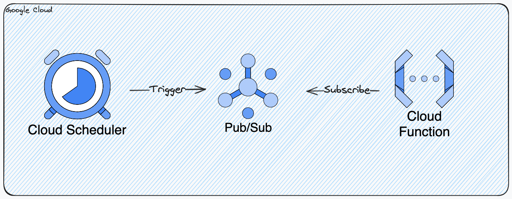

# gciam-expired-cleaner
Cloud Functions that deletes expired conditions in IAM set in Google Cloud.



## Setup

```sh
pnpm i # Install packages
brew install dotenvx/brew/dotenvx # Install dotenv-cli
```

テスト実行時に`dotenvx`を使って環境変数を設定する。
その為、`.env.dev`を作成し、有効期限切れを削除したいプロジェクトをカンマ区切りで指定する。

```:.env.dev
GCP_PROJECT_IDS="PROJECT-A,PROJECT-B"
```

## Test

```sh
pnpm dev
```

Once the port is open, run it in another terminal.

```sh
curl localhost:8080 \
  -X POST \
  -H "Content-Type: application/json" \
  -H "ce-id: 123451234512345" \
  -H "ce-specversion: 1.0" \
  -H "ce-time: 2020-01-02T12:34:56.789Z" \
  -H "ce-type: google.cloud.pubsub.topic.v1.messagePublished" \
  -H "ce-source: //pubsub.googleapis.com/projects/MY-PROJECT/topics/MY-TOPIC" \
  -d '{
    "message": {
      "data": "d29ybGQ=",
      "attributes": {
        "attr1":"attr1-value"
      }
    },
    "subscription": "projects/MY-PROJECT/subscriptions/MY-SUB"
  }'
```

## Deploy

```sh
sh scripts/deploy.sh
```

